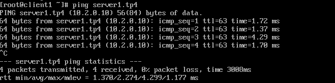
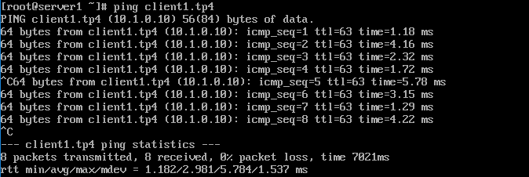
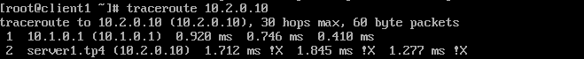

# Mise en place du routage statique.
1) On test

- client1 doit ping server1:
   

- server1 doit ping client1:
  

- traceroute depuis le client pour voir le chemin 
  

# Spéléologie réseau.

1.   ARP

a.   Manip 1:

i)   sur client1:

-    afficher la table ARP:
     

-    explication :
       `La commande ip neigh show dev enp0s8 ne montre aucun résultat car apres le sudo ip neigh flush all, il n'y a aucun packets qui passent. Il est donc normal que la commande ip neigh show dev enp0s8 n'affiche rien.`

ii)  sur server1:

-    afficher la table ARP:
     

-    explication :
     `La commande ip neigh show dev enp0s8 ne montre aucun résultat car apres le sudo ip neigh flush all, il n'y a aucun packets qui passent.Il est donc c'est normal que la commande ip neigh show dev enp0s8 n'affiche rien.`

iii) sur client1:

-    ping server1:
     

-    afficher la table ARP:
     

-    explication suite au changement: `le voisin est valide, mais est probablement inaccessible, le kernel essaiera par conséquent de le vérifier lors de la première transmission.`

iv)  sur server1:

-    afficher la table ARP:
     

-    explication suite au changement: `le voisin est valide, mais est probablement inaccessible, le noyau essaiera par conséquent de le vérifier lors de la première transmission.`

b. Manip 2

    vider la table ARP de toutes les machines

    sur router1:

    afficher la table ARP:

-   

    explication: `La commande ne retourne rien car nous avons vidé la table ARP et ensuite afficher la table ARP. Il ne connait rien donc la table ARP ne pourra pas afficher.`

-   `sur client1`

    `ping server1:`

     

-   `sur router1`

    `afficher la table ARP`

     

     expliquer le changement:

c. Manip 3
-    `vider la table ARP de toutes les machines`

-    afficher la table ARP:

    `PS C:\Users\callo> arp -a

    Interface : 10.1.0.1 --- 0xe
    Adresse Internet      Adresse physique      Type
    10.1.0.10             08-00-27-7c-89-c3     dynamique
    10.1.0.254            08-00-27-e9-91-30     dynamique
    10.1.0.255            ff-ff-ff-ff-ff-ff     statique
    224.0.0.2             01-00-5e-00-00-02     statique
    224.0.0.22            01-00-5e-00-00-16     statique
    224.0.0.251           01-00-5e-00-00-fb     statique
    224.0.0.252           01-00-5e-00-00-fc     statique
    230.0.0.1             01-00-5e-00-00-01     statique
    239.192.152.143       01-00-5e-40-98-8f     statique
    239.255.255.250       01-00-5e-7f-ff-fa     statique

    Interface : 10.188.83.190 --- 0x12
    Adresse Internet      Adresse physique      Type
    10.188.0.1            20-47-47-83-1c-60     dynamique
    10.188.30.172         a0-88-69-86-8b-d9     dynamique
    10.188.92.200         48-6d-bb-be-b1-12     dynamique
    10.188.255.52         a4-17-31-76-eb-03     dynamique
    10.188.255.255        ff-ff-ff-ff-ff-ff     statique
    224.0.0.2             01-00-5e-00-00-02     statique
    224.0.0.22            01-00-5e-00-00-16     statique
    224.0.0.251           01-00-5e-00-00-fb     statique
    224.0.0.252           01-00-5e-00-00-fc     statique
    230.0.0.1             01-00-5e-00-00-01     statique
    239.192.152.143       01-00-5e-40-98-8f     statique
    239.255.255.250       01-00-5e-7f-ff-fa     statique
    255.255.255.255       ff-ff-ff-ff-ff-ff     statique

    Interface : 10.2.0.1 --- 0x17
    Adresse Internet      Adresse physique      Type
    10.2.0.10             08-00-27-0c-22-3c     dynamique
    10.2.0.254            08-00-27-38-f8-3b     dynamique
    10.2.0.255            ff-ff-ff-ff-ff-ff     statique
    224.0.0.2             01-00-5e-00-00-02     statique
    224.0.0.22            01-00-5e-00-00-16     statique
    224.0.0.251           01-00-5e-00-00-fb     statique
    224.0.0.252           01-00-5e-00-00-fc     statique
    230.0.0.1             01-00-5e-00-00-01     statique
    239.192.152.143       01-00-5e-40-98-8f     statique
    239.255.255.250       01-00-5e-7f-ff-fa     statique`

-    vider la table ARP:

     `PS C:\Users\callo> arp -d`

-    afficher de nouveau la table ARP:

     `PS C:\Users\callo> arp -a

      Interface : 10.1.0.1 --- 0xe
      Adresse Internet      Adresse physique      Type
      10.1.0.255            ff-ff-ff-ff-ff-ff     statique
      224.0.0.22            01-00-5e-00-00-16     statique
      230.0.0.1             01-00-5e-00-00-01     statique
      239.255.255.250       01-00-5e-7f-ff-fa     statique

      Interface : 10.188.83.190 --- 0x12
      Adresse Internet      Adresse physique      Type
      10.188.255.255        ff-ff-ff-ff-ff-ff     statique
      224.0.0.22            01-00-5e-00-00-16     statique
      230.0.0.1             01-00-5e-00-00-01     statique
      239.255.255.250       01-00-5e-7f-ff-fa     statique

      Interface : 10.2.0.1 --- 0x17
      Adresse Internet      Adresse physique      Type
      10.2.0.255            ff-ff-ff-ff-ff-ff     statique
      224.0.0.22            01-00-5e-00-00-16     statique
      230.0.0.1             01-00-5e-00-00-01     statique
      239.255.255.250       01-00-5e-7f-ff-fa     statique`

-    `Attendre...`

-    afficher encore la table ARP:

    `PS C:\Users\callo> arp -a

    Interface : 10.1.0.1 --- 0xe
    Adresse Internet      Adresse physique      Type
    10.1.0.255            ff-ff-ff-ff-ff-ff     statique
    224.0.0.2             01-00-5e-00-00-02     statique
    224.0.0.22            01-00-5e-00-00-16     statique
    224.0.0.251           01-00-5e-00-00-fb     statique
    224.0.0.252           01-00-5e-00-00-fc     statique
    230.0.0.1             01-00-5e-00-00-01     statique
    239.192.152.143       01-00-5e-40-98-8f     statique
    239.255.255.250       01-00-5e-7f-ff-fa     statique

    Interface : 10.188.83.190 --- 0x12
    Adresse Internet      Adresse physique      Type
    10.188.0.1            20-47-47-83-1c-60     dynamique
    10.188.11.56          7c-7a-91-8f-7d-e8     dynamique
    10.188.74.16          94-9a-a9-74-33-5b     dynamique
    10.188.92.200         48-6d-bb-be-b1-12     dynamique
    10.188.255.52         a4-17-31-76-eb-03     dynamique
    10.188.255.255        ff-ff-ff-ff-ff-ff     statique
    224.0.0.2             01-00-5e-00-00-02     statique
    224.0.0.22            01-00-5e-00-00-16     statique
    224.0.0.251           01-00-5e-00-00-fb     statique
    224.0.0.252           01-00-5e-00-00-fc     statique
    230.0.0.1             01-00-5e-00-00-01     statique
    239.192.152.143       01-00-5e-40-98-8f     statique
    239.255.255.250       01-00-5e-7f-ff-fa     statique
    255.255.255.255       ff-ff-ff-ff-ff-ff     statique

    Interface : 10.2.0.1 --- 0x17
    Adresse Internet      Adresse physique      Type
    10.2.0.255            ff-ff-ff-ff-ff-ff     statique
    224.0.0.2             01-00-5e-00-00-02     statique
    224.0.0.22            01-00-5e-00-00-16     statique
    224.0.0.251           01-00-5e-00-00-fb     statique
    224.0.0.252           01-00-5e-00-00-fc     statique
    230.0.0.1             01-00-5e-00-00-01     statique
    239.192.152.143       01-00-5e-40-98-8f     statique
    239.255.255.250       01-00-5e-7f-ff-fa     statique`

-    explication du changement :``

D. Manip 4

-  vider la table ARP de toutes vos machines

-  `sur client1:`

-  afficher la table ARP:

   `[root@client1 ~]# ip neigh show`

   `10.1.0.1 dev enp0s8 lladdr 0a:00:27:00:00:0e REACHABLE`

-  `activer la carte NAT.`

-  joindre internet (on va prende google normal):

   `[root@client1 ~]# curl google.com`

   `<HTML><HEAD><meta http-equiv="content-type" content="text/html;charset=utf-8">`

   `<TITLE>301 Moved</TITLE></HEAD><BODY>`

   `<H1>301 Moved</H1>`

   `The document has moved`

   `<A HREF="http://www.google.com/">here</A>.`

    `</BODY></HTML>`

-  afficher la table ARP:

   `[root@client1 ~]# ip neigh show`

    `10.0.2.2 dev enp0s3 lladdr 52:54:00:12:35:02 STALE`

    `10.1.0.1 dev enp0s8 lladdr 0a:00:27:00:00:0e DELAY`

-  expliquer le(ou les) changement(s): ``

-  expliquer quelle machine porte l'IP qui vient de pop dans cette table ARP: ``

l `Machine(tp4)`l `Net1(IP)`l `Net 2 (IP)`  l`Adresse physique`

l `client1.tp4` l`10.1.0.10`l   `X(Notnet2)`l`08-00-27-7c-89-c3`

l `server1.tp4` l`X(Notnet1)`l `10.2.0.10`  l`08-00-27-0c-22-3c`

l `router1.tp4` l`10.1.0.254`l `10.2.0.254` l `10.1.0.254: 08-00-27-e9-91-30 ` , `10.2.0.254: 08-00-27-38-f8-3b`

